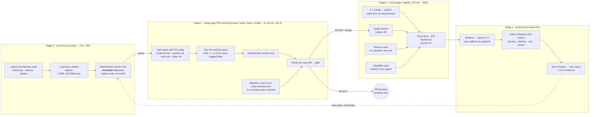
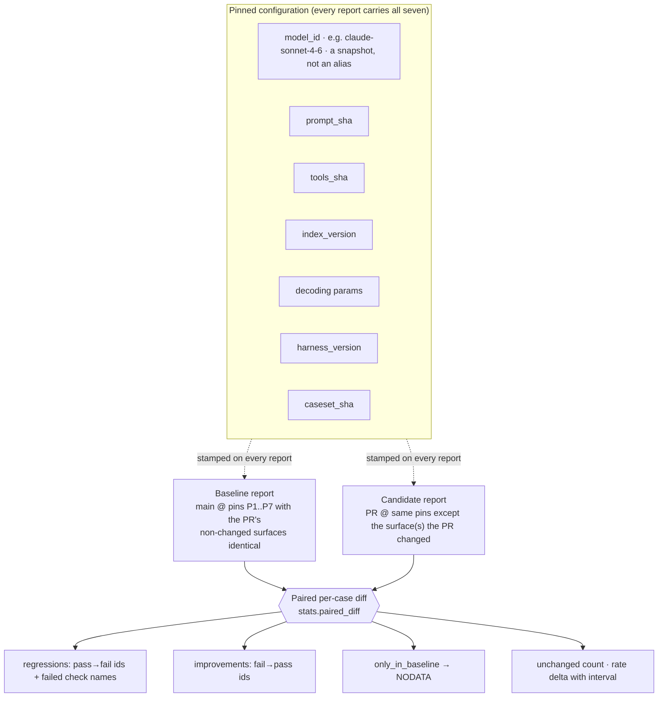
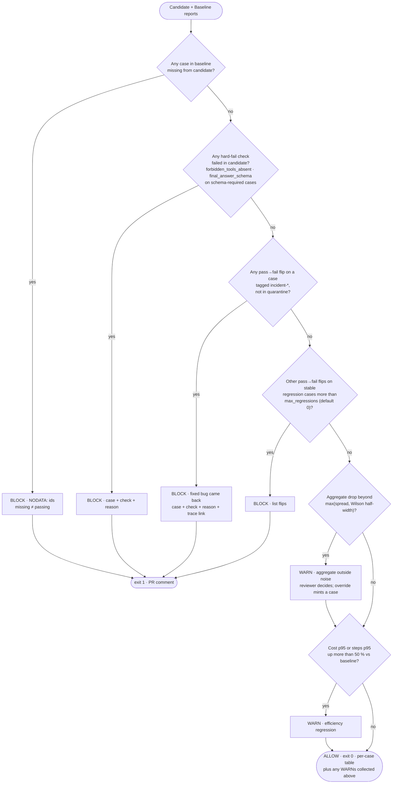
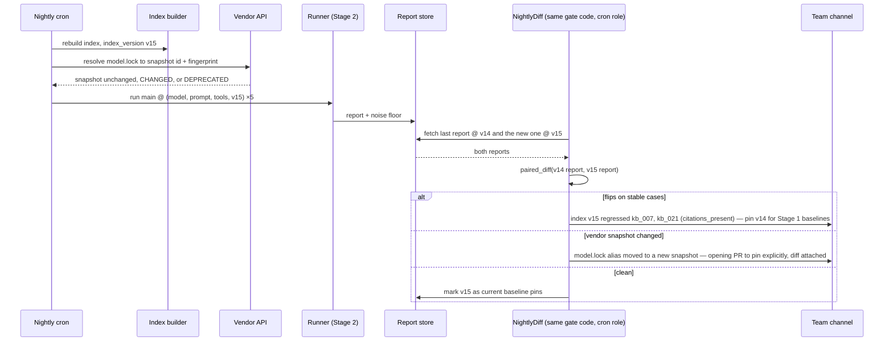

# Eval-gated CI/CD — reference solution

*Read after the drill, not before. This is one defensible design, not the only one; where it makes a
choice, the "Decisions" table at the end says what the alternative was and why it lost. Every
mechanism here is grounded in a source listed at the bottom; the numbers are the ones from the
lecture notes, applied.*

---

## 0 · Restating the problem in the vocabulary of the lecture

Four things change the agent's behaviour, edited by different people at different rates: **prompt**
(several times a week), **tool schemas** (weekly), **retrieval index** (nightly, by other teams),
**model ID** (every few months, sometimes by the vendor). Fifteen PRs a week. A full 40-case
deterministic run is ~6 min and ~$2. Next week a judge joins.

The design has to answer four questions, and they map onto the four words in the drill title:

| Word | Question | Lecture anchor |
|---|---|---|
| **Thresholds** | What number, on what comparison, decides? | Part 4 §4.5 (interval widths), part 8 §8.4 (per-case pairing) |
| **Noise** | How much does the suite move with nothing changed, and how do we keep that out of the decision? | Part 8 §8.2 (Google flakiness), Miller §4.2, Blum & Hardt's Ladder |
| **Blocking policy** | What stops a merge, what warns, what is merely recorded, who overrides? | Part 8 §8.4; Braintrust default `terminate_on_failure: false`; Kayenta `NODATA` |
| **Rollback** | How is a bad change undone, including one we did not make? | Part 8 §8.4 (re-pin); SRE Workbook ch. 16; Sato's canary rollback |

One framing sentence before the diagrams, because it decides the architecture: **a test asserts a
property and must be 100 %; an eval estimates a rate and its acceptable value is a product decision**
(part 8 §8.1). The pipeline is therefore *two* pipelines wearing one YAML file — a test pipeline
that fails on any red, and an eval pipeline that fails on a *statistically defensible regression* —
and the line between them is drawn by cost and latency, not by importance (Fowler: "each stage
provides increasing confidence, usually at the cost of extra time").

---

## 1 · Stages



**Stage 0 is tests.** Nothing here calls a model. `pytest test_checks.py` over the check code; the
case files validated against the generated JSON Schema; and the *deterministic checks replayed over
recorded trajectories* — the recordings committed in the build (ASSIGNMENT §4.4). The third item is
the trick that lets most of the harness run on every commit for free: it tests "does the check code
still classify these known trajectories the same way," which is a property, so it must be 100 %. It
does not test the agent. Anything red here is a bug in the harness or a malformed case; fix before
anything else runs (Hamel–Shankar FAQ: favour "assertions or other deterministic checks over
LLM-as-judge evaluators" in CI).

**Stage 1 is the eval gate — live, pinned, deterministic.** It runs only on PRs whose diff touches one
of the four behaviour-changing surfaces (a path filter: `prompts/**`, `tools/**`, `index.lock`,
`model.lock`). Fifteen such PRs a week × ~$4 (candidate + occasionally baseline) ≈ $60/week, ~2 h of
runner time — affordable, which is what makes the design possible. It runs *deterministic checks
only*: the judge is too slow, too expensive and (until validated next week) too uncalibrated to
block a merge. Cases previously flagged flaky (§3) run with `trials: 3` and `pass^k` semantics.

**Stage 2 is everything expensive, on `main`, producing trend lines rather than merge decisions.**
The judge; the held-out slice under its one-look rule (cases/heldout/README.md); the capability
suite, whose pass rate is *supposed* to be low (Anthropic: "should start at a low pass rate");
five-trial runs that both give `pass^5` per case and re-measure the noise floor; and the trend store
that Lecture 42's dashboards read.

**Stage 3 is production and belongs to Lecture 40**, but it is drawn because the loop closes there:
online reference-free checks catch new failures, error analysis names them, cases are minted, one
in five goes to the held-out slice before anyone tunes (part 7 §7.5).

**What caching buys and does not.** LangSmith's cassette cache, promptfoo's 24 h TTL and Braintrust's
proxy all let you replay yesterday's model outputs. A cached run is a *test* of your code against
fixed outputs, which is exactly right for Stage 0 and exactly wrong for Stage 1: a PR that changes
the prompt invalidates every cached completion by construction. So: Stage 0 replays; Stage 1 never
does; Stage 2 caches judge calls keyed on (trajectory sha, judge prompt sha).

---

## 2 · What is compared



**The baseline is not "the last number on main."** The SRE Workbook's warning is aimed at exactly the
lazy version: "Before/After Evaluation Is Risky," because anything else that changed between the two
runs — the nightly index rebuild, a vendor alias moving — lands in the diff and gets blamed on the PR.
So the baseline is **a run of `main` under pins identical to the candidate on every surface the PR
did not touch.** Concretely: the runner stores every Stage 1 and Stage 2 report keyed on the seven
pins; the gate looks up a baseline whose pins match the candidate's except on the PR's changed
surface(s) and is no older than the last index rebuild; if none exists, it runs one (that is the
"$2–6" and "6–18 min" range in the diagram). Kayenta does the same thing when it runs a fresh
*baseline* instance beside the canary rather than comparing to history.

**The comparison is per case** (Miller §4.2: "conducting statistical inference on the question-level
paired differences … a 'free' reduction in estimator variance"). `stats.paired_diff` returns the ids
that flipped each way, the ids present in one report only, and the net. The aggregate rate and its
Wilson interval are reported *alongside* — they are context, not the decision.

**Model ID must be a snapshot.** Anthropic: 4.6-generation dateless IDs "map to a single, fixed model
snapshot"; earlier dateless names were aliases; and "Anthropic does not update the weights or
configuration of an existing model ID." OpenAI's equivalent is the dated snapshot plus
`system_fingerprint`. If `model.lock` contains an alias, two reports a week apart are not comparable
and the whole design is theatre.

---

## 3 · Thresholds and the noise floor

### 3.1 Measure before you choose

Run the **unchanged** system over the working set `k = 5` times (Stage 2, nightly, so it is
re-measured after every index rebuild and costs $10). Feed the five verdict maps to
`stats.noise_floor`. Two numbers come out:

- `flaky_cases`: ids that were not identical across all five runs — Google's definition, "a test that
  exhibits both a passing and a failing result with the same code."
- `rate_spread`: max − min of the five aggregate rates.

**Worked example** on forty cases. Suppose three cases flake (7.5 %; Google's own fleet is at 16 %)
and the five aggregate rates are 0.850, 0.825, 0.875, 0.850, 0.825 → spread 5 pp. Then:

| Quantity | Value | Meaning |
|---|---|---|
| Wilson 95 % half-width at 34/40 | ≈ 11 pp | The interval on *one* run |
| Observed spread over 5 runs | 5 pp | What "nothing changed" looks like |
| Detectable aggregate regression | > ~10 pp with confidence; 5 pp is inside the noise | A 5-point drop on 40 cases is **not evidence** |
| Per-case flips on non-flaky cases | 0 expected | A single flip on a *stable* case **is evidence** |

That table is the whole argument for gating on per-case flips rather than on the aggregate: at
`n = 40`, the aggregate cannot see a real 5-point regression, but a case that has passed 40 times in a
row and now fails has flipped for a reason.

### 3.2 The Ladder as the threshold rule

Blum & Hardt's Ladder: report a new score only when it beats the incumbent by more than a step size
`η`, else keep the old number. Applied to *accepting improvements*: a prompt change that moves the
aggregate by less than the measured spread is recorded as "no change," not as "+2.5 pp." Applied to
*blocking*: the aggregate threshold, if one is used at all, is `baseline_rate − max(spread, Wilson
half-width)`, re-derived from the latest noise measurement, never a hand-picked 95 %.

### 3.3 Flaky cases

A flaky case is a fact about the *system* (part 1: non-determinism is a property), so the response is
not to delete it. Three options, in order:

1. **`trials: 3`, `pass^k`.** The case runs three times in Stage 1 and passes only if all three pass.
   This turns "flaky" into "the reliability of this behaviour is below 1," which is what τ-bench's
   `pass^k` measures, and it is the honest report.
2. **Quarantine** (Google's remedy): the case moves to a `quarantine` tag, is excluded from the gate,
   still runs, still appears in the report, and has a ticket. Time-boxed — a case quarantined for
   more than two weeks is reviewed.
3. **Rewrite the check.** Often the flakiness is in the *expectation*: `exact` where `normalized` was
   meant; `expected_steps` set too tight. Criteria drift cuts both ways — but the rewrite happens on
   the working set, with the change noted in `origin.note`.

Who decides: the case's owner (the person named in `origin`), in the PR that flags it. The gate
never silently drops a case.

---

## 4 · Blocking policy



**Blocks** (exit 1). Each one names a case id and a check name — "rate went down" is never a block:

| Condition | Why it blocks | Source |
|---|---|---|
| `NODATA`: a case with a baseline result has no candidate trajectory | Missing is not passing. A crashed runner must not turn a red suite green. | Kayenta's `NODATA` classification |
| Hard-fail check failed: `forbidden_tools_absent` on any case; `final_answer_schema` on cases whose downstream parser requires it | Some checks are properties, not rates. A blast-radius tool firing once is an incident. | Braintrust: "A schema-validity scorer may need a perfect score"; Lecture 36 |
| A pass→fail flip on a case tagged `incident-*` (not quarantined) | The production drill's rule: a fixed bug does not come back silently. | SQLite regression rule; Anthropic: regression evals "nearly 100 %" |
| More than `max_regressions` (default 0) other flips on stable `regression`-kind cases | On stable cases a flip is signal at any `n`; the allowance exists so one can be raised deliberately while the noise floor is being re-measured. | Miller §4.2 pairing |

**Warns** (exit 0, loud comment, reviewer must acknowledge):

| Condition | Why only warn |
|---|---|
| Aggregate drop beyond the noise floor with no stable-case flips | On 40 cases this is rare and usually means several flaky cases moved together; the reviewer reads the per-case table. |
| Cost or steps p95 up > 50 % | Efficiency matters (Lecture 35's harness metrics) but the budget rail already caps the worst case. |
| A *capability* case flipped either way | Tracked, never gated. |
| Judge score movement (from Lecture 38) | Until the judge's agreement with humans is measured and stable, its score is context. |

**Recorded only:** improvements; unchanged; the interval; the noise floor used. Braintrust's Action
ships with `terminate_on_failure: false` — inform, not block — and that is the correct default posture
for everything not in the block table above.

**Override.** A block can be overridden by a second reviewer with a written reason, and the override
*mints a case*: either the failing case's expectation was wrong (fix it in the same PR, note why) or
the behaviour change is intended (update the case, note the product decision). An override that
changes nothing in `cases/` is not allowed — otherwise the suite decays into the 100 %-and-meaningless
state the Hamel–Shankar FAQ warns about.

---

## 5 · Regression versus capability

Two tags, two fates. `kind: regression` cases are read by the gate. `kind: capability` cases run in
Stage 2, are plotted, and are promoted to regression only when they have passed on `main` for two
consecutive weeks *and* a human has vouched for the expectation (cases/README.md rule 1). This is
the mechanism that stops the regression suite from freezing: new hard cases enter as capability, the
system catches up, they graduate. A regression suite at 100 % with a capability suite at 40 % is a
healthy pair; a single suite at 100 % is a suite nobody is learning from.

---

## 6 · Pinning, provenance, and changes nobody PR'd



Two of the four change surfaces move *without* a PR — the nightly index and, if `model.lock` is an
alias or the snapshot is deprecated, the model. The design's answer is to treat them as PRs anyway:
the nightly job runs the suite under the new pins, diffs against the last report under the old pins,
and posts the result. The **index rebuild** is the common case: another team edited the docs, chunk
ids shifted, three `citations_present` cases flipped. That is a real regression in *your* system
caused by *their* change, and the diff names the chunks. The **vendor change** is rarer and worse: the
fingerprint or resolved snapshot changed, and the pipeline's job is to make it show up as a diff in
CI *before* it shows up as a mystery drop in production. Hence: never an alias in `model.lock`; a
nightly resolve-and-compare; and a deprecation notice becomes a PR that pins the successor and
carries its own Stage 1 diff.

Every report carries all seven pins. A report missing any of them is rejected by the store — a
report you cannot reproduce is a report you cannot compare.

---

## 7 · Rollback

Rollback is **re-pinning**, not redeploying. Because the four surfaces are versioned and the agent
reads its configuration from the lock files, rolling back is a one-line change to the lock and a
config reload, and it is *tested by the same gate*: the rollback PR's candidate is compared against
the bad baseline and must show the flips reversing.

| Surface | Rollback action | Time | Note |
|---|---|---|---|
| Prompt | `prompt.lock` → previous sha | minutes | Prompt registry keeps every sha; Stage 1 report for the reverted sha already exists |
| Tool schemas | `tools.lock` → previous sha | minutes | Tool *code* may also need reverting if the schema change was coupled to it — keep them in one PR so one revert undoes both |
| Index | `index.lock` → v14 | minutes if v14 is retained; hours if it must be rebuilt | Retain the last three index versions (Lecture 33's zero-downtime reindex already does this) |
| Model (own change) | `model.lock` → previous snapshot | minutes | Only possible if the previous snapshot still exists — check deprecation dates when pinning |
| Model (vendor deprecation) | Cannot roll back; roll *forward* to the successor snapshot behind the gate | hours–days | This is why the nightly resolve-and-compare exists: the successor's diff is known before the deadline |

**Relation to the canary (Lecture 40).** Offline eval proves the change did not break anything you
already knew to check, on inputs you control, before any user sees it. A canary proves the change
did not break the metrics you monitor, on real inputs, for 5 % of users — SRE Workbook: "if we
instead use a canary population of 5 %, we serve 20 % errors for 5 % of traffic, resulting in a 1 %
overall error rate." Neither replaces the other: the gate catches the known failure modes cheaply and
early; the canary catches the unknown ones expensively and late, with automatic rollback (Sato: "the
rollback strategy is simply to reroute users back to the old version"). The canary's guardrail
metrics are the reference-free checks from part 5 §5.3 — schema validity, citation presence, cost,
latency, refusal rate — computed online, and the SRE rule of "perhaps no more than a dozen" applies.

---

## 8 · The reviewer's view

What the PR comment must contain, so that `BLOCKED` is actionable without re-running:

```
### Eval gate — BLOCKED (1 regression on a tagged case)

Candidate: prompt 7c1e2a · model claude-sonnet-4-6 · tools 91bd · index v15   Baseline: main d4f0 · same pins
Working set: 40 cases · candidate 35/40 (87.5 %, 95 % CI 73.9–94.5) · baseline 36/40 (90.0 %, 76.9–96.0)
Noise floor (5 runs, 2026-09-09): spread 5.0 pp · flaky: kb_014, refund_022, cycle_031 (run with trials=3)

| case | tags | flip | check | reason | stability |
|---|---|---|---|---|---|
| refund_002_precedence | regression, incident-2026-08-14 | pass → FAIL | precedence | process_refund@step 2 before any verify_identity | stable 41/41 runs → [trajectory diff] |
| kb_019_policy_lookup | regression | pass → FAIL | citations_present | missing: ['chunk_7'] | flaky 3/5 last week (quarantine? → owner @gd) |
| refund_027_partial | regression | FAIL → pass | — | — | stable |

Blocked by: refund_002_precedence (precedence). A fixed production bug from 2026-08-14 has come back.
Override requires a second reviewer and a change to cases/.
Cost p95 0.041 → 0.044 (+7 %) · steps p95 5 → 5 · NODATA: none
```

Five things make that actionable: the *pins* (so the reviewer knows what was compared); the *interval*
beside every rate (so 87.5 vs 90.0 is read as "no aggregate evidence"); the *per-case table* with the
check name and the reason string produced by the check itself (convention C1: specific enough to find
the step); the *stability column* from the noise-floor store (so the reviewer knows which flip is
signal); and the *link to the trajectory diff* (the recorded trajectory from baseline beside the one
from the candidate, tool call by tool call). `WARN` uses the same table with a different header and a
required acknowledgement checkbox in the PR; a WARN that is never acknowledged is escalated on merge.

---

## 9 · Decisions

| Decision | Chosen | Alternative | Why it lost |
|---|---|---|---|
| What gates a merge | Deterministic checks only, per-case | Judge in the gate too | Judge is slow, costly, and not yet validated; blocking on an uncalibrated instrument is blocking on noise with extra steps (Lecture 38) |
| Baseline | Re-run `main` under matching pins, cached by pin tuple | Last number on `main` | SRE "Before/After Evaluation Is Risky": the nightly index rebuild lands in the diff |
| Threshold | Per-case flips on stable cases; aggregate only warns | 95 % pass-rate floor | At n = 40 the aggregate's interval is ±11 pp; a fixed floor either blocks on noise or never blocks |
| Flaky cases | `trials: 3` + `pass^k`, then quarantine with ticket | Delete them | Flakiness is a fact about the system (τ-bench pass^8); deleting it hides it |
| Noise floor | Re-measured nightly (k = 5) after index rebuild | Measured once | Any pin change can change the spread; a stale floor is a wrong threshold |
| `NODATA` | Blocks | Skipped | A runner crash must not look like a green suite (Kayenta) |
| Model ID | Snapshot in a lock file; nightly resolve-and-compare | Alias | Aliases move under you; the diff would be invisible until production |
| Override | Second reviewer + a change to `cases/` | Anyone, with a comment | Overrides that change nothing decay the suite to 100 %-and-meaningless |
| Capability suite | Stage 2 only, plotted | In the gate with a low threshold | A suite that is supposed to fail should not be able to block |
| Rollback | Re-pin lock files, gated | Redeploy previous container | Behaviour lives in four versioned surfaces; the container did not change |
| Held-out slice | Stage 2, on schedule, one look, refreshed on action | Run on every PR | Every PR run is a tune-loop look; the slice would be spent in a week (part 4) |

---

## 10 · What this design does not do, and knows it

It cannot detect a five-point aggregate regression on forty cases; nobody can. It detects flips on
stable cases and collapses. To detect small aggregate drifts it needs the case set to grow toward the
hundreds (Miller: ~1,000 for a 3-pp effect at 80 % power) — which the production drill's rule does
one bug at a time — and the judge and online monitoring from the next three lectures. It also depends
on the honesty of `origin`: a case set that is all synthetic, all easy, or all complaints measures
something other than the system (part 3, part 7 §7.5). And it depends on people acknowledging WARNs,
which no pipeline can force; the escalation-on-merge rule is the least bad answer.

---

**Sources used in this solution** (all in `READING.md` §8 and §4): Fowler, "DeploymentPipeline" ·
Warner & Davidovič, SRE Workbook ch. 16, §"What Is Canarying?", §"Choosing a Canary Population and
Duration", §"Selecting and Evaluating Metrics", §"Before/After Evaluation Is Risky" · Graff & Sanden,
"Automated Canary Analysis at Netflix with Kayenta," §"Judgment" (Pass/High/Low, `NODATA`), §"Reporting"
· Miller, "Adding Error Bars to Evals," §2.1, §4.2, §5 · Blum & Hardt, "The Ladder," §3 · Micco,
"Flaky Tests at Google" (definition; fail-3-in-a-row; quarantine) · Anthropic, "Model IDs and
versions" · Anthropic Engineering, "Demystifying evals for AI agents," §"Capability vs. regression
evals," §"How to think about non-determinism" · Braintrust, "braintrust-eval" Action
(`terminate_on_failure`, PR comment format); "How to turn LLM production failures into regression
tests," §"Run regression evals in CI/CD" · Hamel Husain & Shreya Shankar, "AI Evals FAQ," §"Production
& Deployment" · LangSmith, "How to run evaluations with pytest," §"Caching" · promptfoo, "CI/CD
integration," §"Quality Gates," §"Caching Strategies" · Sato, "CanaryRelease" · SQLite, "How SQLite Is
Tested," §5 · Yao et al., "τ-bench," abstract.
